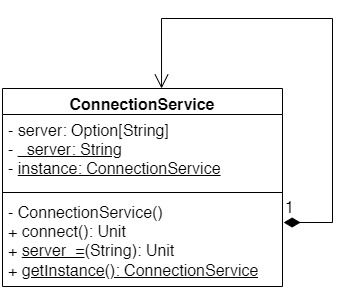

# Tabla de contenidos

- [Tabla de contenidos](#tabla-de-contenidos)
- [Parte 1: Patrones de Diseño](#parte-1-patrones-de-diseño)
  - [Ejercicio 1: Identificación de Patrones de Diseño](#ejercicio-1-identificación-de-patrones-de-diseño)
    - [Programa 10: Servicio de Conexión](#programa-10-servicio-de-conexión)
- [Parte 2: Excepciones](#parte-2-excepciones)
  - [Ejercicio 1: Clases de Excepciones](#ejercicio-1-clases-de-excepciones)
  - [Ejercicio 2: Checked vs Unchecked Exceptions](#ejercicio-2-checked-vs-unchecked-exceptions)
  - [Ejercicio 4: Manejo de Excepciones](#ejercicio-4-manejo-de-excepciones)
    - [4.1.](#41)
    - [4.2.](#42)
    - [4.3.](#43)

Parte 1: Patrones de Diseño
===========================

Ejercicio 1: Identificación de Patrones de Diseño
-------------------------------------------------

### Programa 10: Servicio de Conexión

1. **Nombre del patrón:** Singleton
2. 


3. 
```scala
ConnectionService.server = "anakena.dcc.uchile.cl"
val connectionService = ConnectionService.getInstance()
connectionService.connect()
```

Parte 2: Excepciones
====================

Ejercicio 1: Clases de Excepciones
----------------------------------

- `Throwable` es la clase base de todos los objetos que pueden ser lanzados y capturados por un 
  bloque `try`.
- `Exception` es la clase base de todas las excepciones que no son errores.
  Por lo general, las excepciones representan condiciones de las que un programa razonable podría 
  querer recuperarse. 
- `Error` es la clase base para las condiciones de error que una aplicación normalmente no intenta 
  capturar.
  La clase ``Error`` define excepciones que no se espera que sean capturadas bajo circunstancias 
  normales por tu programa. 
  Estas condiciones normalmente ocurren en casos donde la JVM se encuentra en un estado que no puede 
  recuperarse, como ``OutOfMemoryError``.
  Mientras que Exception y sus subclases representan condiciones excepcionales que tu programa puede
  querer capturar, ``Error`` y sus subclases representan condiciones anormales que pueden hacer que 
  tu programa se comporte de manera impredecible o incluso se bloquee. 

Ejercicio 2: Checked vs Unchecked Exceptions
--------------------------------------------

Las checked exceptions son aquellas que el compilador obliga a capturar o relanzar.
Las unchecked exceptions son aquellas que el compilador no obliga a capturar o relanzar.

En Scala no existen las checked exceptions.

Ejercicio 4: Manejo de Excepciones
----------------------------------

### 4.1.

```scala
class OutOfRangeException(message: String) extends Exception(message)

def isOutOfRange(i: Int, min: Int, max: Int): Unit = {
  if (i < min || i > max) {
    throw new OutOfRangeException(s"Value $i is out of range [$min, $max]")
  }
}
```

### 4.2.

```scala
class InvalidRangeException(message: String) extends Exception(message)

def isOutOfRange(i: Int, lo: Int, hi: Int): Unit = {
  checkRange(lo, hi)
  if (i < lo || i > hi) {
    throw new OutOfRangeException(s"Value $i is out of range [$lo, $hi]")
  }
}

def checkRange(lo: Int, hi: Int): Unit = {
  if (lo >= hi) {
    throw new InvalidRangeException(s"Invalid range [$lo, $hi]")
  }
}
```

### 4.3.

```scala
object Main {
  def main(args: Array[String]): Unit = {
    while (true){
      val lo = readLine("Enter a number for the lower bound: ")
      // If all characters are digits then the input is an integer
      if (lo.forall(_.isDigit)) {
        val loNumber = lo.toInt
        val hi = readLine("Enter a number for the upper bound: ")
        if (hi.forall(_.isDigit)) {
          val hiNumber = hi.toInt
          val input = readLine(s"Enter a number: ")
          if (input.forall(_.isDigit)) {
            val number = input.toInt
            try {
              isOutOfRange(number, loNumber, hiNumber)
              println(s"Number $number is in range [$loNumber, $hiNumber]")
            } catch {
              case e: OutOfRangeException => println(e.getMessage)
              case e: InvalidRangeException => println(e.getMessage)
            }
          } else {
            return
          }
        } else {
          return
        }
      } else {
        return
      }
    }
  }
}
```