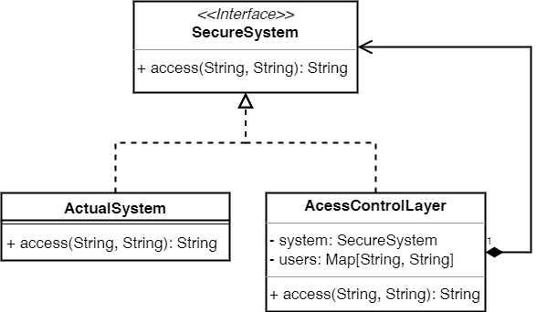
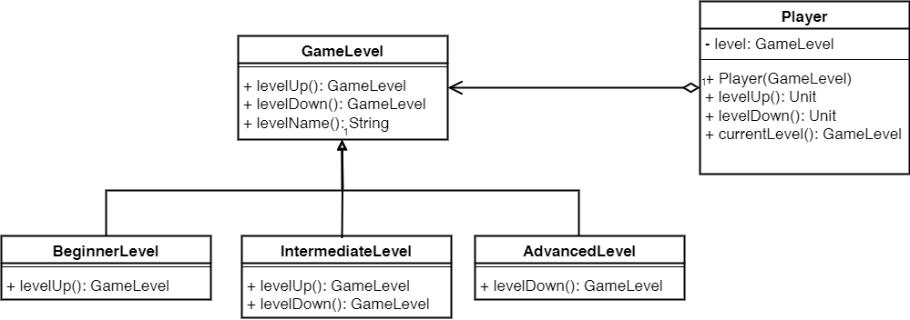
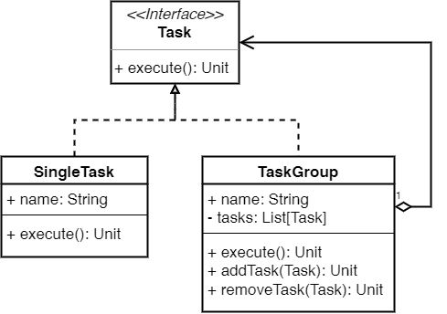

# Tabla de contenidos

- [Tabla de contenidos](#tabla-de-contenidos)
- [Parte 1: Patrones de Diseño](#parte-1-patrones-de-diseño)
  - [Ejercicio 1: Identificación de Patrones de Diseño](#ejercicio-1-identificación-de-patrones-de-diseño)
    - [Programa 2: Control de acceso](#programa-2-control-de-acceso)
    - [Programa 5: Interacción entre personajes](#programa-5-interacción-entre-personajes)
    - [Programa 7: Niveles de juego](#programa-7-niveles-de-juego)
    - [Programa 10: Servicio de Conexión](#programa-10-servicio-de-conexión)
    - [Programa 11: Gestión de tareas](#programa-11-gestión-de-tareas)
- [Parte 2: Excepciones](#parte-2-excepciones)
  - [Ejercicio 1: Clases de Excepciones](#ejercicio-1-clases-de-excepciones)
  - [Ejercicio 2: Checked vs Unchecked Exceptions](#ejercicio-2-checked-vs-unchecked-exceptions)
  - [Ejercicio 3: Buenas prácticas](#ejercicio-3-buenas-prácticas)
  - [Ejercicio 4: Manejo de Excepciones](#ejercicio-4-manejo-de-excepciones)
    - [4.1.](#41)
    - [4.2.](#42)
    - [4.3.](#43)
  - [Ejercicio 5: Orden de Ejecución](#ejercicio-5-orden-de-ejecución)
    - [5.1.](#51)
    - [5.2.](#52)
    - [5.3.](#53)
    - [5.4.](#54)
    - [5.5.](#55)
- [Parte 3: Generics](#parte-3-generics)
  - [Ejercicio 2: Varianza](#ejercicio-2-varianza)
  - [Ejercicio 3: Type Constraints](#ejercicio-3-type-constraints)
    - [2. Ordenación de elementos](#2-ordenación-de-elementos)
  - [Ejercicio 4: Curiously Recurring Template Pattern](#ejercicio-4-curiously-recurring-template-pattern)

Parte 1: Patrones de Diseño
===========================

Ejercicio 1: Identificación de Patrones de Diseño
-------------------------------------------------

### Programa 2: Control de acceso

1. **Nombre del patrón:** Proxy
2. 


### Programa 5: Interacción entre personajes

1. **Nombre del patrón:** Double Dispatch
2. 


### Programa 7: Niveles de juego

1. **Nombre del patrón:** State
2. 

3. El patrón State se utiliza en este sistema para permitir que un objeto 
   `Player` cambie su comportamiento dinámicamente cuando su estado interno 
   cambia.
   En este caso, el patrón es conveniente porque permite definir transiciones
   invalidas entre estados.
  
### Programa 10: Servicio de Conexión

1. **Nombre del patrón:** Singleton
2. 


1. 
```scala
ConnectionService.server = "anakena.dcc.uchile.cl"
val connectionService = ConnectionService.getInstance()
connectionService.connect()
```

### Programa 11: Gestión de tareas

1. **Nombre del patrón:** Composite
2. 


Parte 2: Excepciones
====================

Ejercicio 1: Clases de Excepciones
----------------------------------

- `Throwable` es la clase base de todos los objetos que pueden ser lanzados y capturados por un 
  bloque `try`.
- `Exception` es la clase base de todas las excepciones que no son errores.
  Por lo general, las excepciones representan condiciones de las que un programa razonable podría 
  querer recuperarse. 
- `Error` es la clase base para las condiciones de error que una aplicación normalmente no intenta 
  capturar.
  La clase ``Error`` define excepciones que no se espera que sean capturadas bajo circunstancias 
  normales por tu programa. 
  Estas condiciones normalmente ocurren en casos donde la JVM se encuentra en un estado que no puede 
  recuperarse, como ``OutOfMemoryError``.
  Mientras que Exception y sus subclases representan condiciones excepcionales que tu programa puede
  querer capturar, ``Error`` y sus subclases representan condiciones anormales que pueden hacer que 
  tu programa se comporte de manera impredecible o incluso se bloquee. 

Ejercicio 2: Checked vs Unchecked Exceptions
--------------------------------------------

Las checked exceptions son aquellas que el compilador obliga a capturar o relanzar.
Las unchecked exceptions son aquellas que el compilador no obliga a capturar o relanzar.

En Scala no existen las checked exceptions.

Ejercicio 3: Buenas prácticas
-----------------------------

**Creación de excepciones personalizadas**

1. **Claridad:** Al usar excepciones personalizadas, puedes proporcionar más 
  detalles sobre el tipo de error que ocurrió.
  En lugar de lanzar una excepción genérica (como `RuntimeException`) con un 
  mensaje de error, puedes lanzar una excepción con un nombre descriptivo que 
  indique claramente qué salió mal.

2. **Manejo específico:** Cuando lanzas una excepción personalizada, los 
  llamadores pueden capturar y manejar específicamente esa excepción.
  Esto permite a quien llama decidir cómo manejar diferentes tipos de errores de
  una manera más controlada.

3. **Documentación:** Las excepciones personalizadas sirven como una forma de
  documentación.
  Al mirar la lista de excepciones personalizadas en tu código, puedes obtener
  una comprensión rápida de los diferentes tipos de errores que pueden ocurrir.

**Atrapar excepciones de tipo `Exception`**

1. **Demasiado amplio:** `Exception` es la superclase de todas las excepciones
  (incluyendo ``Error``, que son excepciones que no deberían ser capturadas). 
  Atrapar `Exception` significa que estás atrapando todas las excepciones, 
  incluidas las que podrías no esperar ni saber cómo manejar adecuadamente.
  Esto puede ocultar errores y hacer que el diagnóstico de problemas sea más
  difícil.

2. **Interrupción del flujo de control:** Atrapar y manejar excepciones debe
  hacerse solo cuando puedes manejarlas de manera significativa.
  Si estás atrapando todas las excepciones, estás esencialmente diciendo que tu
  código sabe cómo manejar cualquier tipo de error que pueda ocurrir, lo cual es
  poco probable y puede llevar a comportamientos inesperados.

3. **Pobre diseño:** Atrapar `Exception` es a menudo un signo de un diseño
  pobre.
  En lugar de entender y manejar las condiciones de error específicas, estás
  utilizando un enfoque de "*one size fits all*" que puede ser difícil de
  mantener y extender.

Por estas razones, es una mejor práctica capturar solo las excepciones que sabes
cómo manejar y dejar que las excepciones que no puedes manejar se propaguen
hacia arriba para que puedan manejarse en un nivel más alto o se informen como
errores no recuperables.

Ejercicio 4: Manejo de Excepciones
----------------------------------

### 4.1.

```scala
class OutOfRangeException(message: String) extends Exception(message)

def isOutOfRange(i: Int, min: Int, max: Int): Unit = {
  if (i < min || i > max) {
    throw new OutOfRangeException(s"Value $i is out of range [$min, $max]")
  }
}
```

### 4.2.

```scala
class InvalidRangeException(message: String) extends Exception(message)

def isOutOfRange(i: Int, lo: Int, hi: Int): Unit = {
  checkRange(lo, hi)
  if (i < lo || i > hi) {
    throw new OutOfRangeException(s"Value $i is out of range [$lo, $hi]")
  }
}

def checkRange(lo: Int, hi: Int): Unit = {
  if (lo >= hi) {
    throw new InvalidRangeException(s"Invalid range [$lo, $hi]")
  }
}
```

### 4.3.

```scala
object Main {
  def main(args: Array[String]): Unit = {
    while (true){
      val lo = readLine("Enter a number for the lower bound: ")
      // If all characters are digits then the input is an integer
      if (lo.forall(_.isDigit)) {
        val loNumber = lo.toInt
        val hi = readLine("Enter a number for the upper bound: ")
        if (hi.forall(_.isDigit)) {
          val hiNumber = hi.toInt
          val input = readLine(s"Enter a number: ")
          if (input.forall(_.isDigit)) {
            val number = input.toInt
            try {
              isOutOfRange(number, loNumber, hiNumber)
              println(s"Number $number is in range [$loNumber, $hiNumber]")
            } catch {
              case e: OutOfRangeException => println(e.getMessage)
              case e: InvalidRangeException => println(e.getMessage)
            }
          } else {
            return
          }
        } else {
          return
        }
      } else {
        return
      }
    }
  }
}
```

Ejercicio 5: Orden de Ejecución
-------------------------------

### 5.1.

```scala
1 -> println("A")
2 -> throw new Exception("B")
3 -> case e: Exception => println("C")
4 -> println("D")
```

### 5.2.

```scala
1 -> println("A")
2 -> throw new Exception("B")
3 -> println("D")
```

### 5.3.

```scala
println("A")
throw new Exception("B")
case e: Exception => println("D")
println("E")
```

### 5.4.

```scala
println("A")
throw new IllegalArgumentException("B")
case e: Exception => println("D")
println("E")
```

### 5.5.

```scala
println("A")
return 1
println(foo())
```

Parte 3: Generics
=================

Ejercicio 2: Varianza
---------------------

Recordando la definición de varianza:

- **Co-variante:** Si `A` es subtipo de `B`, entonces `List[A]` es subtipo de `List[B]`.
- **Invariante:** Si `A` es subtipo de `B`, entonces `List[A]` no es subtipo de `List[B]`.
- **Contra-variante:** Si `A` es subtipo de `B`, entonces `List[B]` es subtipo de `List[A]`.

1. Si `A` es subtipo de `B`, entonces `List[A]` es subtipo de `List[B]`.
  R: Falso, los generics son invariantes por defecto.
1. Si `A` es co-variante, entonces `List[A]` es subtipo de `List[Any]`.
  R: Verdadero, si `A` es co-variante, entonces `List[A]` es subtipo de `List[B]` 
  para cualquier `B` que sea super-tipo de `A`.
2. Si `A` es subtipo de `B`, y `B` es co-variante, entonces `A` es co-variante.
  R: Verdadero, si `B` es co-variante, entonces `A` debe ser co-variante
4. Si `A` es subtipo de `B` y `B` es invariante, entonces `List[B]` es subtipo de `List[A]`.
  R: Falso, si `B` es invariante, entonces `List[B]` no es subtipo de `List[A]`.
5. Si `A` es subtipo de `B` y `B` es contra-variante, entonces `List[A]` es subtipo de `List[B]`.
  R: Falso, si `B` es contra-variante, entonces `List[B]` es subtipo de `List[A]`.

Ejercicio 3: Type Constraints
-----------------------------

### 2. Ordenación de elementos

```scala
def max[T <: Ordered[T]](elementos: List[T]): T = {
  if (elementos.isEmpty) throw new IllegalArgumentException("Lista vacía")
  else if (elementos.size == 1) elementos.head
  else {
    val maximo = max(elementos.tail)
    if (elementos.head > maximo) elementos.head else maximo
  }
}
```

Ejercicio 4: Curiously Recurring Template Pattern
------------------------------------------------

1. ``DNA`` debe ser invariante ya que se ocupa como input y output de la 
  interfaz ``Gene``.
  ``G`` debe ser covariante ya que sólo se ocupa como output de la interfaz 
  ``Gene``.
2. ``DNA`` no necesita restricciones de tipo.
  ``G`` debe ser subtipo de ``Gene[DNA, G]``.
3. 
```scala
class BoolGene(val dna: Boolean) extends Gene[Boolean, BoolGene] {
  def mutate(): BoolGene = new BoolGene(new Random().nextBoolean())
  def withDna(dna: Boolean): BoolGene = new BoolGene(dna)
}

class IntGene(val dna: Int) extends Gene[Int, IntGene] {
  def mutate(): IntGene = new IntGene(new Random().nextInt())
  def withDna(dna: Int): IntGene = new IntGene(dna)
}
```
