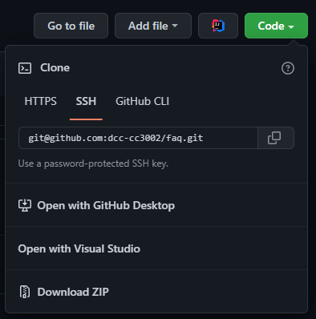

# Fpreguntas Afrecuentes Q

- [Fpreguntas Afrecuentes Q](#fpreguntas-afrecuentes-q)
  - [Programación](#programación)
    - [Leyendo la documentación del lenguaje encontré algo que no vimos en clases. ¿Lo puedo usar?](#leyendo-la-documentación-del-lenguaje-encontré-algo-que-no-vimos-en-clases-lo-puedo-usar)
  - [*IntelliJ*](#intellij)
    - [*IntelliJ* no me pone colores bonitos en mi código Q-Q](#intellij-no-me-pone-colores-bonitos-en-mi-código-q-q)
  - [*Git*](#git)
    - [Descargué mi código directo de *GitHub* no se como conectarlo por *Git* al repositorio D,:](#descargué-mi-código-directo-de-github-no-se-como-conectarlo-por-git-al-repositorio-d)

## Programación

### Leyendo la documentación del lenguaje encontré algo que no vimos en clases. ¿Lo puedo usar?

Sí, pero pregunta antes de hacerlo.
Puedes utilizar cualquier herramienta que provea el lenguaje, pero si no lo hemos visto en clases te 
arriesgas a utilizarlo mal; en este caso, es mejor no ocupar una herramienta a ocuparla mal.


## *IntelliJ*

### *IntelliJ* no me pone colores bonitos en mi código Q-Q

Anda a ``File | Invalidate Caches`` marca todas las checkboxes y espera a que se reinicie 
completamente *IntelliJ*.

## *Git*

### Descargué mi código directo de *GitHub* no se como conectarlo por *Git* al repositorio D,:

Lo más probable es que no hayas clonado correctamente el repositorio.
Para clonarlo debes ir a tu repositorio en *GitHub* y hacer click en el botón ``Code`` (El botón 
verde D:), ahí, dependiendo de cómo hayan configurado *Git* deben copiar el link HTTPS, SSH o GitHub 
CLI.



Luego, con el link copiado, hacen:

```bash
git clone <link HTTPS o SSH>
# Con GitHub CLI sólo tienen que pegar lo que copiaron en la terminal.
# Debiera verse así
gh repo clone <su repo>
```

Ahora comprueben que funciona haciendo:

```bash
# Desde la carpeta de su repo
git status
```